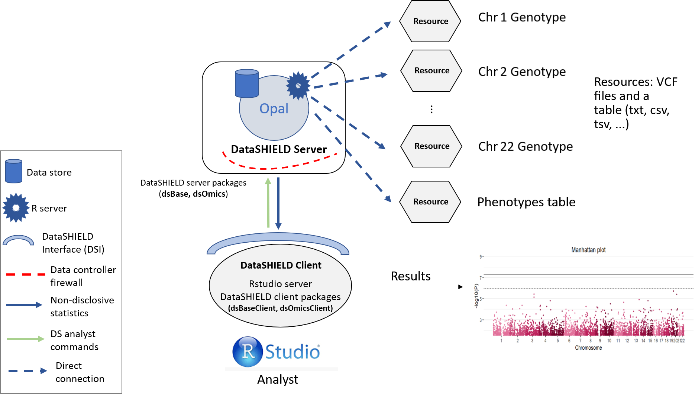
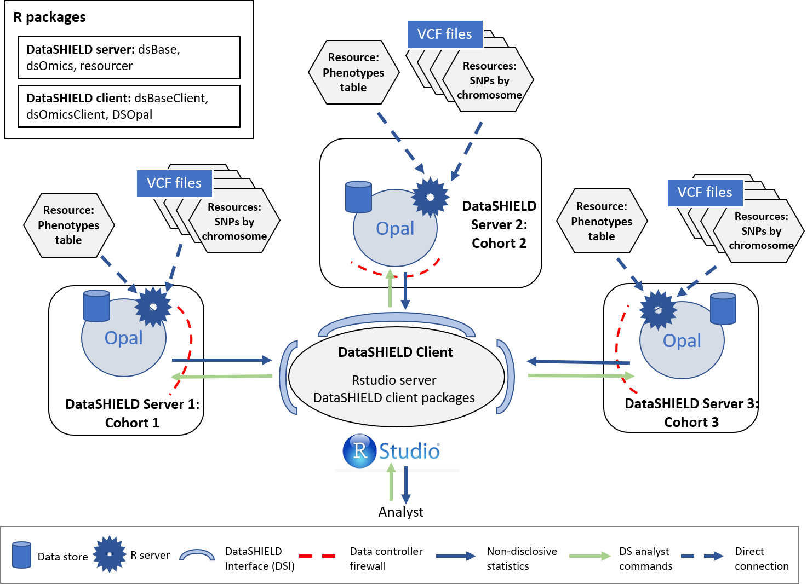
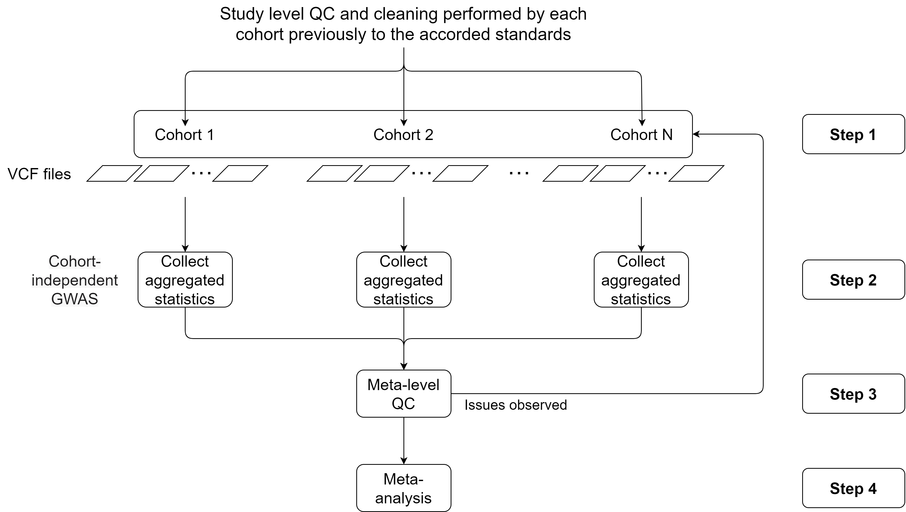

# Genome wide association study (GWAS) analysis

Three different use cases will be illustrated:

-   Single cohort GWAS. Using data from all the individuals.
-   Multi-cohort GWAS. Using the same individuals as the single cohort separated into three synthetic cohorts.
-   Polygenic risk score. Using data from all the individuals.

For all the illustrated cases we will use data divided by chromosome (VCF files). The procedure is the same if all the variants are on a single VCF.

The phenotype information used throughout this section is not contained inside the VCF files mentioned previously, it is contained using traditional CSV/Excel files. This is to replicate the typical scenario where an investigator receives the genomic and phenotype data separated and has to merge it to study a specific relationship between the gene expression / variants and a certain phenotype.

The data used along this section is a synthetic data set generated by the CINECA project made freely available under the Creative Commons Licence (CC-BY) (funding: EC H2020 grant 825775). It has been pruned and the individuals have been separated into three synthetic cohorts. For the "Single cohort" use case, all the individuals are used. Information on individuals and SNP count of each cohort can be found on the Table \@ref(tab:tab1).

|                       | Cohort 1 | Cohort 2 | Cohort 3 |   Total |
|-----------------------|---------:|---------:|---------:|--------:|
| Number of SNPs        |  865,240 |  865,240 |  865,240 | 865,240 |
| Number of individuals |      817 |    1,073 |      614 |   2,504 |

: (\#tab:tab1) Numer of SNPs and individuals by cohort

## Single cohort

<table><colgroup><col style="width: 100%" /></colgroup><thead><tr class="header"><th style="text-align: left;"><p>`r emo::ji("warning")` RESOURCES USED ALONG THIS SECTION</p></th></tr></thead><tbody><tr class="odd"><td style="text-align: left;"><p>From <a href="https://opal-demo.obiba.org/">https://opal-demo.obiba.org/</a> :</p></td></tr><tr class="even"><td style="text-align: left;"><table><thead><tr class="header"><th><p>STUDY</p></th><th><p>TABLE</p></th><th><p>PROFILE</p></th></tr></thead><tbody><tr class="odd"><td><p>cohort1</p></td><td><p>GWAS.chr{1..21}</p></td><td><p>omics</p></td></tr><tr
class="odd"><td><p>cohort1</p></td><td><p>GWAS.ega_phenotypes</p></td><td><p>omics</p></td></tr><tr 
</tbody></table></td></tr></tbody></table>

The single cohort analysis is a way of performing a GWAS study guaranteeing GDPR data confidentiality. The structure followed is illustrated on the following figure.

```{r singleCohortImage, echo=FALSE, fig.cap="Proposed infrastructure to perform single-cohort GWAS studies.", fig.align='center'}

```

The data analyst corresponds to the "RStudio" session, which through DataSHIELD Interface (DSI) connects with the Opal server located at the cohort network. This Opal server contains an array of resources that correspond to the different VCF files (sliced by chromosome) [^1] and a resource that corresponds to the phenotypes table of the studied individuals.

[^1]: The same methodology and code can be used with unitary VCF resources that contain the variant information of all chromosomes.

### Connection to the Opal server

We have to create an Opal connection object to the cohort server. We do that using the following functions.

```{r single_cohort_ds_login, message=FALSE, warning=FALSE}
require('DSI')
require('DSOpal')
require('dsBaseClient')
require('dsOmicsClient')

builder <- DSI::newDSLoginBuilder()
builder$append(server = "cohort1", url = "https://opal-demo.obiba.org/",
               user =  "dsuser", password = "P@ssw0rd",
               driver = "OpalDriver", profile = "omics")
logindata <- builder$build()
conns <- DSI::datashield.login(logins = logindata)
```

### Assign the VCF resources

Now that we have created a connection object to the Opal, we have started a new R session on the server, our analysis will take place in this remote session, so we have to load the data into it.

In this use case we will use 21 different resources from the `GWAS` project hosted on the [demo Opal server](https://opal-demo.obiba.org/). This resources correspond to VCF files with information on individual chromosomes. The names of the resources are `chrXX` (where XX is the chromosome number). Following the Opal syntax, we will refer to them using the string `GWAS.chrXX`.

To load the resources we will use the `DSI::datashield.assign.resource()` function. Note that along the use case we use the `lapply` function to simplify our code since we have to perform repetitive operations. `lapply` is a way of creating loops in R, for more information visit [the documentation](https://www.rdocumentation.org/packages/base/versions/3.6.2/topics/lapply).

```{r single_cohort_assign_resources, message=FALSE, warning=FALSE, results=FALSE}
lapply(1:21, function(x){
  DSI::datashield.assign.resource(conns, paste0("chr", x), paste0("GWAS.chr", x))
  })
```

Now we have assigned all the resources named `GWAS.chrXX` into our remote R session. We have assigned them to the variables called `chrXX`. To verify this step has been performed correctly, we could use the `ds.class` function to check for their class and that they exist on the remote session.

```{r single_cohort_check_class_resource}
ds.class("chr1")
```

To resolve the resources and retrieve the data in the remote session we will use the `DSI::datashield.assign.expr()` function. This function runs a line of code on the remote session [^2], and in particular we want to run the function `as.resource.object()`, which is the DataSHIELD function in charge of resolving the resources.

[^2]: The same methodology and code can be used with unitary VCF resources that contain the variant information of all chromosomes.

```{r single_cohort_resolve_resources, message=FALSE, warning=FALSE, results=FALSE}
lapply(1:21, function(x){
  DSI::datashield.assign.expr(conns = conns, symbol = paste0("gds", x, "_object"),
                            expr = as.symbol(paste0("as.resource.object(chr", x, ")")))
})
```

Now we have resolved the resources named `chrXX` into our remote R session. The objects retrieved have been assigned into variables named `gdsXX_object`. We can check the process was successful as we did before.

```{r single_cohort_check_class}
ds.class("gds1_object")
```

### Assign the phenotypes

The objects we have loaded into our remote session are VCF files that contain genomic information of the individuals. To perform a GWAS this information has to be related to some phenotypes to extract relationships. Therefore, we need to load the phenotypes into the remote session. The phenotypes information is a table that contains the individuals as rows and phenotypes as columns. In this use case, we will use a resource (as with the VCF files) to load the phenotypes table into the remote session.

The procedure is practically the same as before with some minor tweaks. To begin, we have the phenotypes information in a single table (hence, a single resource). Then, instead of using the function `as.resource.object`, we will use `as.resource.data.frame`, this is because before we were loading a special object (VCF file) and now we are loading a plain table, so the internal treatment on the remote session has to be different.

```{r single_cohort_assign_covariates_table}
DSI::datashield.assign.resource(conns, "pheno", "GWAS.ega_phenotypes")
DSI::datashield.assign.expr(conns = conns, symbol = "pheno_object",
                            expr = quote(as.resource.data.frame(pheno)))
```

We can follow the same analogy as before to know that we have assigned the phenotypes table to a variable called `pheno_object` on the remote R session.

```{r single_cohort_check_class_table}
ds.class("pheno_object")
```

We can also check the column names to see which information is present on the table.

```{r single_cohort_check_table_cols}
ds.colnames("pheno_object")[[1]]
```

### Merge VCF (genotype) and phenotype information {#vcf_merge}

Arrived at this point, we have 21 VCF objects (each one corresponds to a chromosome) and a phenotypes table on our remote session. The next step is merging each of the VCF objects with the phenotypes table. Before doing that however, we have to gather some information from the phenotypes table. The information to gather is summarized on the Table \@ref(tab:tab2).

+---------------------------------------------------------------+----------------------------------------------------------------------------------------------------------------------------------------------------------------------------------------------------------------------------------------------------+
| Information                                                   | Details                                                                                                                                                                                                                                            |
+===============================================================+====================================================================================================================================================================================================================================================+
| Which column has the samples identifier?                      | Column name that contains the IDs of the samples. Those are the IDs that will be matched to the ones present on the VCF objects.                                                                                                                   |
+---------------------------------------------------------------+----------------------------------------------------------------------------------------------------------------------------------------------------------------------------------------------------------------------------------------------------+
| Which is the sex column on the covariates file?               | Column name that contains the sex information.                                                                                                                                                                                                     |
+---------------------------------------------------------------+----------------------------------------------------------------------------------------------------------------------------------------------------------------------------------------------------------------------------------------------------+
| How are males and how are females encoded into this column?   | There is not a standard way to encode the sex information, some people use 0/1; male/female; etc. Our approach uses a library that requires a specific encoding, for that reason we need to know the original encoding to perform the translation. |
+---------------------------------------------------------------+----------------------------------------------------------------------------------------------------------------------------------------------------------------------------------------------------------------------------------------------------+
| Which is the case-control column?                             | Column name that contains the case/control to be studied.                                                                                                                                                                                          |
+---------------------------------------------------------------+----------------------------------------------------------------------------------------------------------------------------------------------------------------------------------------------------------------------------------------------------+
| What is the encoding for case and for control on this column? | Similar as the sex column, the case/control will be translated to the particular standard of the software we have used to develop our functionalities [^3] .                                                                                       |
+---------------------------------------------------------------+----------------------------------------------------------------------------------------------------------------------------------------------------------------------------------------------------------------------------------------------------+

: (\#tab:tab2) Information to gather from the phenotypes table.

[^3]: It's important to note that all the other encodings present on the case-control column that are not the case or control, will be turned into missings. As an example, if we have `"cancer"`/`"no cancer"`/`"no information"`/`"prefer not to answer"` we can specifcy `case="cancer"`, `control="no cancer"` and all the individuals with `"no information"`/`"prefer not to answer"` will be interpreted as missings.

If we are not sure about the exact column names, we can use the function `ds.colnames` as we did before. Also, we can use the function `ds.table1D` to check the level names of the categorical variables.

```{r single_cohort_tables_of_columns, message=FALSE, warning=FALSE}
ds.table1D("pheno_object$sex")$counts
ds.table1D("pheno_object$diabetes_diagnosed_doctor")$counts
```

From the different functions we used, we can extract our answers (Summarized on the Table \@ref(tab:tab3))

+-----------------------------------------------------------------+-----------------------------+
| Question                                                        | Answer                      |
+=================================================================+=============================+
| Which column has the samples identifier?                        | "subject_id"                |
+-----------------------------------------------------------------+-----------------------------+
| Which is the sex column on the covariates file?                 | "sex"                       |
+-----------------------------------------------------------------+-----------------------------+
| How are males and how are females encoded into this column?     | "male"/"female"             |
+-----------------------------------------------------------------+-----------------------------+
| Which is the case-control column of interest of the covariates? | "diabetes_diagnosed_doctor" |
+-----------------------------------------------------------------+-----------------------------+
| What is the encoding for case and for control on this column?   | "Yes"/"No"                  |
+-----------------------------------------------------------------+-----------------------------+

: (\#tab:tab3) Summary of options from the example phenotypes table.

With all this information we can now merge the phenotypes and VCF objects into a type of object named GenotypeData. We will use the `ds.GenotypeData` function.

```{r single_cohort_create_genoData, message=FALSE, warning=FALSE, results=FALSE}
lapply(1:21, function(x){
  ds.GenotypeData(x=paste0('gds', x,'_object'), covars = 'pheno_object', 
                  columnId = "subject_id", sexId = "sex", 
                  male_encoding = "male", female_encoding = "female",
                  case_control_column = "diabetes_diagnosed_doctor", 
                  case = "Yes", control = "No", 
                  newobj.name = paste0('gds.Data', x), datasources = conns)
})
```

The objects we just created are named `gds.DataXX` on the remote session. Now we are ready to perform a GWAS analysis. To perform a GWAS we have to supply this "Genotype Data" objects and some sort of formula in which we will specify the type of association we are interested on studying. The R language has it's own way of writing formulas, a simple example would be the following (relate the `condition` to the `smoke` variable adjusted by `sex`):

```{r eval=F}
condition ~ smoke + sex
```

For this use case we will use the following formula.

```{r eval=F}
diabetes_diagnosed_doctor ~ sex + hdl_cholesterol
```

### Performing the GWAS

We are finally ready to achieve our ultimate goal, performing a GWAS analysis. We have our data (genotype + phenotypes) organized into the correspondent objects (GenotypeData) and our association formula ready. The function `ds.metaGWAS` is in charge of doing the analysis, we have to supply it with the names of the GenotypeData objects of the remote R session and the formula. Since we have 21 different objects, the `paste0` function is used to simplify the call.

```{r single_cohort_GWAS, message=FALSE, warning=FALSE}
results_single <- ds.metaGWAS(genoData = paste0("gds.Data", 1:21), 
                              model = diabetes_diagnosed_doctor ~ sex + hdl_cholesterol)[[1]]

results_single
```

We can display the results of the GWAS using a Manhattan plot.

```{r singleCohortManhattan_plot, message=FALSE, warning=FALSE, fig.cap="Manhattan plot of the single-cohort results.", fig.align='center'}
manhattan(results_single)
```

Moreover, we can visualize the region with the lowest p-value in detail using the function `LocusZoom`. There are multiple arguments to control the gene annotation, display a different region of the GWAS, display a different range of positions and more. Make sure to check `?LocusZoom` for all the details.

```{r locuszoom, message=FALSE, warning=FALSE, fig.cap="LocusZoom plot of the surrounding region of the top hit SNP.", fig.align='center'}
LocusZoom(results_single, use_biomaRt = FALSE)
```

```{r}
datashield.logout(conns)
```

## Multi cohorts

<table><colgroup><col style="width: 100%" /></colgroup><thead><tr class="header"><th style="text-align: left;"><p>`r emo::ji("warning")` RESOURCES USED ALONG THIS SECTION</p></th></tr></thead><tbody><tr class="odd"><td style="text-align: left;"><p>From <a href="https://opal-demo.obiba.org/">https://opal-demo.obiba.org/</a> :</p></td></tr><tr class="even"><td style="text-align: left;"><table><thead><tr class="header"><th><p>STUDY</p></th><th><p>TABLE</p></th><th><p>PROFILE</p></th></tr></thead><tbody><tr class="odd"><td><p>cohort1</p></td><td><p>GWAS.chr{1..21}A</p></td><td><p>omics</p></td></tr><tr
class="odd"><td><p>cohort2</p></td><td><p>GWAS.chr{1..21}B</p></td><td><p>omics</p></td></tr><tr 
class="odd"><td><p>cohort3</p></td><td><p>GWAS.chr{1..21}C</p></td><td><p>omics</p></td></tr><tr 
class="odd"><td><p>cohort1</p></td><td><p>GWAS.ega_phenotypes_1</p></td><td><p>omics</p></td></tr><tr 
class="odd"><td><p>cohort2</p></td><td><p>GWAS.ega_phenotypes_2</p></td><td><p>omics</p></td></tr><tr 
class="odd"><td><p>cohort3</p></td><td><p>GWAS.ega_phenotypes_3</p></td><td><p>omics</p></td></tr><tr 
</tbody></table></td></tr></tbody></table>

Now all the individuals used for the single cohort use case will be divided into three different synthetic cohorts. The results from each cohort will then be meta-analyzed to be compared to the results obtained by studying all the individuals together. As with the single-cohort methodology illustrated on the prior section, this method guarantees GDPR data confidentiality. The structure for a three cohort study is illustrated on the following figure (note this can be extrapolated for cohorts with a bigger (or lower) partner count).

```{r multiCohortImage, echo=FALSE, fig.cap="Proposed infrastructure to perform multi-cohort GWAS studies.", fig.align='center'}

```

The data analyst corresponds to the "RStudio" session, which through DataSHIELD Interface (DSI) connects with the Opal server located at the cohort network. This Opal server contains an array of resources that correspond to the different VCF files (sliced by chromosome) [^4] and a resource that corresponds to the phenotypes table of the studied individuals.

[^4]: The same methodology and code can be used with unitary VCF resources that contain the variant information of all chromosomes.

This use case will portray a complete study methodology, more precisely we will follow this flowchart:

```{r multiCohortFlowchart, echo=FALSE, fig.cap="Flowchart to perform multi-cohort GWAS studies. Adapted from @winkler2014quality", fig.align='center', dpi=300}

```

Brief description of each step:

-   **Step 1:** Logging into the Opal servers and load all the VCF files to the remote R sessions. Corresponds to the sections [Connection to the Opal server](#connection-to-the-opal-server-2), [Assign the VCF resources](#multi-vcf), [Assign the phenotypes](#assign-the-phenotypes-1) and [Merge VCF (genotype) and phenotype information](#merge-vcf-genotype-and-phenotype-information).
-   **Step 2:** Performing a GWAS analysis on each cohort and collect all the aggregated non-disclosive statistics. Corresponds to the sections [Performing the GWAS](#performing-the-gwas-1) and [GWAS Plots].
-   **Step 3:** Apply different QC control methodologies to assess possible problems on the data used on each cohort to perform the analysis. Corresponds to the section [Meta-level quality control].
-   **Step 4:** Perform the meta-analysis of the aggregated statistics. Corresponds to the section [Meta-analysis](#meta-analysis-2).
-   **Step 5:** Perform a pooled ultra fast GWAS and compare the results to the ones of the meta-analysis. Corresponds to the section [Ultra fast GWAS](#ultra-fast-gwas).
-   **Step 6:** Perform post-omics analysis: Enrichment analysis. Corresponds to the section [Post-omic analysis](#post-omics).

### Connection to the Opal server

We have to create an Opal connection object to the different cohorts server. We do that using the following functions.

```{r multi_cohort_ds_login, message=FALSE, warning=FALSE}
require('DSI')
require('DSOpal')
require('dsBaseClient')
require('dsOmicsClient')

builder <- DSI::newDSLoginBuilder()
builder$append(server = "cohort1", url = "https://opal-demo.obiba.org/",
               user =  "dsuser", password = "P@ssw0rd",
               driver = "OpalDriver", profile = "omics")
builder$append(server = "cohort2", url = "https://opal-demo.obiba.org/",
               user =  "dsuser", password = "P@ssw0rd",
               driver = "OpalDriver", profile = "omics")
builder$append(server = "cohort3", url = "https://opal-demo.obiba.org/",
               user =  "dsuser", password = "P@ssw0rd",
               driver = "OpalDriver", profile = "omics")
logindata <- builder$build()
conns <- DSI::datashield.login(logins = logindata)
```

It is important to note that in this use case, we are only using one server that contains all the resources (<https://opal-demo.obiba.org/>), on this server there are all the resources that correspond to the different cohorts. On a more real scenario each one of the `builder$append` instructions would be connecting to a different server.

### Assign the VCF resources {#multi-vcf}

Now that we have created a connection object to the different Opals, we have started three R session, our analysis will take place on those remote sessions, so we have to load the data into them.

In this use case we will use 63 different resources from the `GWAS` project hosted on the [demo Opal server](https://opal-demo.obiba.org/). This resources correspond to VCF files with information on individual chromosomes (21 chromosomes per three cohorts). The names of the resources are `chrXXY` (where XX is the chromosome number and Y is the cohort A/B/C). Following the Opal syntax, we will refer to them using the string `GWAS.chrXXY`.

We have to refer specifically to each different server by using `conns[X]`, this allows us to communicate with the server of interest to indicate to it the resources that it has to load.

```{r multi_cohort_assign_resources, message=FALSE, warning=FALSE, results=FALSE}
# Cohort 1 resources
lapply(1:21, function(x){
  DSI::datashield.assign.resource(conns[1], paste0("chr", x), paste0("GWAS.chr", x,"A"))
  })

# Cohort 2 resources
lapply(1:21, function(x){
  DSI::datashield.assign.resource(conns[2], paste0("chr", x), paste0("GWAS.chr", x,"B"))
  })

# Cohort 3 resources
lapply(1:21, function(x){
  DSI::datashield.assign.resource(conns[3], paste0("chr", x), paste0("GWAS.chr", x,"C"))
  })
```

Now we have assigned all the resources named `GWAS.chrXXY` into our remote R session. We have assigned them to the variables called `chrXX`. To verify this step has been performed correctly, we could use the `ds.class` function to check for their class and that they exist on the remote sessions.

```{r multi_cohort_check_class_resource}
ds.class("chr1")
```

We can see that the object `chr1` exists in all the three servers.

Finally the resources are resolved to retrieve the data in the remote sessions.

```{r multi_cohort_resolve_resources, message=FALSE, warning=FALSE, results=FALSE}
lapply(1:21, function(x){
  DSI::datashield.assign.expr(conns = conns, symbol = paste0("gds", x, "_object"),
                            expr = as.symbol(paste0("as.resource.object(chr", x, ")")))
})
```

Now we have resolved the resources named `chrXX` into our remote R sessions. The objects retrieved have been assigned into variables named `gdsXX_object`. We can check the process was successful as we did before.

```{r multi_cohort_check_class}
ds.class("gds1_object")
```

### Assign the phenotypes {#assign-the-phenotypes-1}

The objects we have loaded into our remote sessions are VCF files that contain genomic information of the individuals. To perform a GWAS this information has to be related to some phenotypes to extract relationships. Therefore, we need to load the phenotypes into the remote sessions. The phenotypes information is a table that contains the individuals as rows and phenotypes as columns. In this use case, we will use a resource (as with the VCF files) to load the phenotypes table into the remote sessions.

As with the VCF resources, here we load a different resource to each cohort, as it is expected that each cohort has only the phenotypes information regarding their individuals, therefore different tables. Note that we are assigning the resource to the same variable at each server (`pheno`), so we only need one function call to resolve all the resources together.

```{r multi_cohort_assign_covariates_table}
# Cohort 1 phenotypes table
DSI::datashield.assign.resource(conns[1], "pheno", "GWAS.ega_phenotypes_1")

# Cohort 2 phenotypes table
DSI::datashield.assign.resource(conns[2], "pheno", "GWAS.ega_phenotypes_2")

# Cohort 3 phenotypes table
DSI::datashield.assign.resource(conns[3], "pheno", "GWAS.ega_phenotypes_3")

# Resolve phenotypes table
DSI::datashield.assign.expr(conns = conns, symbol = "pheno_object",
                            expr = quote(as.resource.data.frame(pheno)))
```

We can follow the same analogy as before to know that we have assigned the phenotypes table to a variable called `pheno_object` on the remote R session.

```{r multi_cohort_check_class_table}
ds.class("pheno_object")
```

We can also check the column names to see which information is present on the table.

```{r}
ds.colnames("pheno_object")[[1]]
```

### Merge VCF (genotype) and phenotype information {#merge-vcf-genotype-and-phenotype-information}

Arrived at this point, we have 21 VCF objects at each cohort R session (each one corresponds to a chromosome) and a phenotypes table. The next step is merging each of the VCF objects with the phenotypes table. The same procedure as the [single cohort](#vcf_merge) can be applied to extract the arguments required.

With all this information we can now merge the phenotypes and VCF objects into a type of object named GenotypeData. We will use the `ds.GenotypeData` function.

```{r multi_cohort_create_genoData, message=FALSE, warning=FALSE, results=FALSE}
lapply(1:21, function(x){
  ds.GenotypeData(x=paste0('gds', x,'_object'), covars = 'pheno_object', 
                  columnId = "subject_id", sexId = "sex",
                  male_encoding = "male", female_encoding = "female",
                  case_control_column = "diabetes_diagnosed_doctor", 
                  case = "Yes", control = "No",
                  newobj.name = paste0('gds.Data', x), datasources = conns)
})
```

The objects we just created are named `gds.DataXX` on the remote session. Now we are ready to perform a GWAS analysis. We will use the same formula as the single cohort use case to be able to compare the results later:

```{r eval=F}
diabetes_diagnosed_doctor ~ sex + hdl_cholesterol
```

### Performing a meta - GWAS {#performing-the-gwas-1}

We now proceed to perform the GWAS analysis.

```{r multi_cohort_GWAS, message=FALSE, warning=FALSE}
results <- ds.metaGWAS(genoData = paste0("gds.Data", 1:21), 
                       model = diabetes_diagnosed_doctor ~ sex + hdl_cholesterol)
```

And we can see the results for each cohort.

::: {#cohort-results .tab}
<button class="tablinks" id="gwas_results_1" onclick="unrolltab(event, 'cohort-results', 'Cohort1')">Cohort 1</button>
<button class="tablinks" onclick="unrolltab(event, 'cohort-results', 'Cohort2')">Cohort 2</button>
<button class="tablinks" onclick="unrolltab(event, 'cohort-results', 'Cohort3')">Cohort 3</button>
::: {#Cohort1 .tabcontent}
#### ⠀ {-}
```{r message=FALSE, warning=FALSE, echo=FALSE}
results[[1]]
```
:::
::: {#Cohort2 .tabcontent}
#### ⠀ {-}
```{r message=FALSE, warning=FALSE, echo=FALSE}
results[[2]]
```
:::
::: {#Cohort3 .tabcontent}
#### ⠀ {-}
```{r message=FALSE, warning=FALSE, echo=FALSE}
results[[3]]
```
:::
:::

### GWAS Plots

We can display the results of the GWAS using a Manhattan plot for each cohort.

::: {#gwas-results .tab}
<button class="tablinks" id="gwas_plot_1" onclick="unrolltab(event, 'gwas-results', 'Cohort1plot')">Cohort 1</button>
<button class="tablinks" onclick="unrolltab(event, 'gwas-results', 'Cohort2plot')">Cohort 2</button>
<button class="tablinks" onclick="unrolltab(event, 'gwas-results', 'Cohort3plot')">Cohort 3</button>
::: {#Cohort1plot .tabcontent}
#### ⠀ {-}
```{r multiCohortManhattanPlot, message=FALSE, warning=FALSE, fig.cap="Manhattan plot of the Cohort 1.", fig.align='center'}
manhattan(results[[1]])
```
:::
::: {#Cohort2plot .tabcontent}
#### ⠀ {-}
```{r multiCohortManhattanPlot2, message=FALSE, warning=FALSE, fig.cap="Manhattan plot of the Cohort 1.", fig.align='center'}
manhattan(results[[2]])
```
:::
::: {#Cohort3plot .tabcontent}
#### ⠀ {-}
```{r multiCohortManhattanPlot3, message=FALSE, warning=FALSE, fig.cap="Manhattan plot of the Cohort 1.", fig.align='center'}
manhattan(results[[3]])
```
:::
:::

### Meta-level quality control

Up to this point we have collected the aggregated statistics from each cohort and we have visualized them. Before meta-analyzing this statistics we have to perform some quality control to make sure there are no major issues. There are three different methods bundled in `dsOmicsClient` to perform such task:

-   **EAF Plot:** Plotting the reported EAFs against a reference set, such as from the HapMap or 1000 Genomes projects, or from one specific study, can help visualize patterns that pinpoint strand issues, allele miscoding or the inclusion of individuals whose self-reported ancestry did not match their genetic ancestry.
-   **P-Z Plot:** Plot to reveal issues with beta estimates, standard errors and P values. The plots compare P values reported in the association GWAS with P values calculated from Z-statistics (P.ztest) derived from the reported beta and standard error. A study with no issues should show perfect concordance. It will generate a plot per study, where concordance of all the study SNPs will be displayed.
-   **SE-N Plot:** Plot to reveal issues with trait transformations. A collection of studies with no issues will fall on a line.

If any of these QC raises some inconsistencies, please contact the correspondent study analyst.

#### EAF Plot

For this plot we are comparing the estimated allele frequencies to a reference set, so the first step is to get ourselves a reference set. For this example we will be using the `ALL.wgs.phase1_release_v3.20101123` reference set. We will download it and load it into the client R session.

```{r download_reference}
reference <- readr::read_tsv("https://homepages.uni-regensburg.de/~wit59712/easyqc/exomechip/ALL.wgs.phase1_release_v3.20101123.snps_indels_sv.sites.EUR_AF.txt.exm.tab.sexChr.DI.txt.GZ")
reference
```

Now we just use the function `eafPlot` and we pass to it the GWAS results and the reference set.

```{r eafPlot, fig.cap="EAF Plot.", fig.align='center'}
eafPlot(x = results, reference = reference, rs_reference = "Rs", freq_reference = "Freq")
```

The obtained results are the expected, which is a linear correlation of slope one. This indicates the alleles are correctly encoded. For further explanation on how to assess the results produced by this plot, please refer to the Figure 4 of @winkler2014quality.

#### P-Z Plot

This plot will assess the issues with beta estimates, standard errors and P values. Here we will only need the results from the `ds.GWAS` function and pass them to the function `pzPlot`.

```{r pzplot, fig.cap="P-Z Plot.", fig.align='center'}
pzPlot(results)
```

Please note that all the SNPs are plotted, for that reason there may be some performance issues if there are many SNPs to be plotted.

A dataset with no issues will show perfect concordance. For further details please refer to the Figure 3 of @winkler2014quality.

#### SE-N Plot

Finally, we will assess issues with trait transformations. For this we will only need the results from the `ds.GWAS` function and pass them to the function `seNPlot`.

```{r senplot, fig.cap="SE-N Plot.", fig.align='center'}
seNPlot(results)
```

If all the study points fall on a line, no issues are present. For further detail please refer to the Figure 2 of @winkler2014quality.

### Meta-analysis

Given no problems have been detected on the meta-level QC, we will proceed. Up to this point, we have obtained association results for each cohort on the study. The next step is to combine this information using meta-analysis methods to derive a pooled estimate. Each researcher might have an already built pipeline to do so, or a preferred method; nevertheless, we included a couple methods inside `dsOmicsClient`. They are the following:

-   Meta-analysis of p-values: Using the sum of logs method (Fisher's method).
-   Meta-analysis of beta values: Using a fixed-effects model. Methodology extracted and adapted from @betameta.

#### Assessment of the meta-analysis methods

Previously, we have calculated the same GWAS analysis both using all the individuals and a simulated three-cohort scenario. This gives us the ability to assess how good or bad are the different meta-analysis methods; to do so, we will compare both meta-analysis to the complete data, the evaluation method will be counting the number of top hits that match, more specifically we will search for matches on the top twenty hits.

We apply both methods to the multi-cohort use case results:

```{r meta_fitting}
meta_pvalues <- metaPvalues(results)
meta_bvalues <- metaBetaValues(results)
```

We can now compare the 20 top hits from the complete data (previously stored on the variable `results_single`) to the 20 top hits yielded by both meta-analysis methodologies.

```{r meta_compare}
# Extract 20 top hits for all three cases
  # All individuals
top_20_complete <- results_single %>% arrange(p.value) %>% head(20)
  # Pvalue meta-analysis
top_20_pval <- meta_pvalues %>% arrange(p.meta) %>% head(20)
  # Beta meta-analysis
top_20_beta <- meta_bvalues %>% arrange(pval) %>% head(20)

# Number of hits shared by all individuals case and beta meta-analysis
sum(top_20_complete$rs %in% top_20_beta$rs)
# Number of hits shared by all individuals case and pvalue meta-analysis
sum(top_20_complete$rs %in% top_20_pval$rs)
```

The meta-analysis using beta values recovers a higher amount of top SNPs, therefore it can be considerate a more powerful method for GWAS meta-analyses.

#### Visualizing the results of the meta-analysis

We can use the manhattan plot and locus zoom to visualize the results of the meta-analysis as we visualized the single cohorts before. To help assess the meta-analysis behaviour, we will plot together the meta-analysis results and the complete data results.

##### Manhatan plot

::: {#manhattan-plots .tab}
<button class="tablinks" id = "manhattan-plots-tab" onclick="unrolltab(event, 'manhattan-plots', 'meta-analysis-gwas')">Meta-analysis</button>
<button class="tablinks" onclick="unrolltab(event, 'manhattan-plots', 'common-truth')">Complete data</button>
::: {#meta-analysis-gwas .tabcontent}
###### ⠀ {-}
```{r message=FALSE, warning=FALSE, fig.cap="Manhattan plot of the meta-analysis results."}
manhattan(meta_bvalues)
```
:::
::: {#common-truth .tabcontent}
###### ⠀ {-}
```{r message=FALSE, warning=FALSE, fig.cap="Manhattan plot of the complete data."}
manhattan(results_single)
```
:::
:::

##### LocusZoom 

::: {#locuszoom-plots .tab}
<button class="tablinks" id = "locuszoom-plots-tabs" onclick="unrolltab(event, 'locuszoom-plots', 'meta-analysis-gwas-locus')">Meta-analysis</button>
<button class="tablinks" onclick="unrolltab(event, 'locuszoom-plots', 'common-truth-locus')">Complete data</button>
::: {#meta-analysis-gwas-locus .tabcontent}
###### ⠀ {-}
```{r message=FALSE, warning=FALSE, fig.cap="LocusZoom plot of the meta-analysis results."}
LocusZoom(meta_bvalues, pvalue = "p.F", use_biomaRt = FALSE)
```
:::
::: {#common-truth-locus .tabcontent}
###### ⠀ {-}
```{r message=FALSE, warning=FALSE, fig.cap="LocusZoom plot of the complete data."}
LocusZoom(results_single, use_biomaRt = FALSE)
```
:::
:::

#### Meta-analysis versus pooled linear models

The `dsOmicsClient` package also bundles a function to fit pooled generalized linear models (GLM) on single (or multiple) SNPs. On this section we will compare the results of the meta-analysis to the pooled GLM models to see which method is more accurate. The meta-analysis method will be the beta values (fixed-effects model).

The study methodology will be similar to the one we just performed. The top 20 hits yielded by the meta-analysis will be selected, those SNPs will be studied using the pooled GLM function. Both results will be compared to the complete data.

We aim to replicate a real scenario with this study, typically there is no access to the complete data (if so there is no point on performing meta-analysis on synthetic multi-cohorts), therefore we simulate the discovery of SNPs of interest via meta-analysis, then we want to assess if studying individually those SNPs using pooled GLM will put us closer to the results yielded by having the complete data.

We have already calculated the top 20 SNPs discovered by the beta meta-analysis.

```{r}
top_20_beta
```

Next, we have to fit pooled GLM using the `ds.glmSNP` function, obviously we have to fit the same model that we did on the GWAS (`Diabetes.diagnosed.by.doctor ~ sex + HDL.cholesterol`), otherwise the results will not be consistent. 

The `ds.glmSNP` function is an extension of the `dsBaseClient::ds.glm` function, therefore it offers pooled analysis capabilities and disclosure controls.

Remember that we have the genotype data separated by chromosome, following that we will construct the GLM calls as follows:

```{r pooled_analysis, message=FALSE, warning=FALSE, results=FALSE}
s <- lapply(1:nrow(top_20_beta), function(x){
  tryCatch({
    ds.glmSNP(snps.fit = top_20_beta[x, 1], 
              model = diabetes_diagnosed_doctor ~ sex + hdl_cholesterol, 
              genoData = paste0("gds.Data", top_20_beta[x, 2]))
  }, error = function(w){NULL})
})
# Simple data cleaning and column name changes
ss <- data.frame(do.call(rbind, s))
ss <- ss %>% rownames_to_column("rs")
pooled <- ss %>% dplyr::rename(Est.pooled = Estimate, 
                               SE.pooled = Std..Error, 
                               pval.pooled = p.value) %>% 
  dplyr::select(-c(n, p.adj))
```

<!-- ```{r} -->
<!-- # ds.glmSNP(snps.fit = unlist(top_20_beta[3:5, 1]), model = diabetes_diagnosed_doctor ~ sex + hdl_cholesterol, genoData = paste0("gds.Data", unlist(top_20_beta[3:5, 2])), mc.cores = 3) -->
<!-- ``` -->

We now extract the results of interest from the meta-analysis and the complete data.

```{r}
# Get data from all individuals study
original <- results_single %>% dplyr::rename(pval.original = p.value, 
                                             Est.original = Est, 
                                             SE.original = Est.SE) %>%
  dplyr::select(c(rs, Est.original, SE.original, pval.original))
# Arrange dadta from beta meta-analysis
beta <- top_20_beta %>% dplyr::rename(pval.beta = pval, 
                                      Est.beta = b.F, 
                                      SE.beta = se.F) %>%
  dplyr::select(c(rs, Est.beta, SE.beta, pval.beta))
# Merge all data on a single table
total <- Reduce(function(x,y){inner_join(x,y, by = "rs")}, 
                list(original, pooled, beta))
```

With all the information gathered we can visualize the results on the Table <a href="#tab:tab4">4</a>.

<caption>

[Table 4: Beta values, standard errors and p-values yielded by the three methods: GWAS of all individuals, meta-analysis of synthetic cohorts, pooled analysis of synthetic cohorts.]{#tab:tab4 style="font-size:8pt"}

</caption>

```{r f, echo=F}
library(gt)
total %>% gt() %>% tab_spanner(label = 'Beta', columns = c(Est.original, Est.pooled, Est.beta)) %>% tab_spanner(label = 'SE', columns = c(SE.original, SE.pooled, SE.beta)) %>% tab_spanner(label = 'P-Value', columns = c(pval.original, pval.pooled, pval.beta)) %>% cols_label(Est.original = "Original", Est.pooled = "Pooled", Est.beta = "Meta", SE.original = "Original", SE.pooled = "Pooled", SE.beta = "Meta", pval.original = "Original", pval.pooled = "Pooled", pval.beta = "Meta", rs = "SNP id") %>% fmt_number(columns = c(Est.original, Est.pooled, Est.beta, SE.original, SE.pooled, SE.beta), decimals = 3) %>% fmt_scientific(columns = c(pval.original, pval.pooled, pval.beta), decimals = 1) %>% tab_options(column_labels.font.weight = "bold") %>% tab_style(style = cell_fill(color = "grey"), locations = list(cells_body(columns = c(SE.original, SE.pooled, SE.beta), rows = c(seq(2,nrow(total),2))))) %>% tab_style(style = cell_fill(color = "lightgray"), locations = list(cells_body(columns = c(SE.original, SE.pooled, SE.beta), rows = c(seq(1,nrow(total),2))))) %>% tab_style(style = cell_borders(sides = "all", color = "lightgrey", style = "solid", weight = px(1)), locations = cells_body(columns = everything(), rows = everything())) %>% tab_style(style = cell_text(color = "red"), locations = list(cells_body(columns = Est.original, rows = Est.original<0))) %>% tab_style(style = cell_text(color = "red"), locations = list(cells_body(columns = Est.beta, rows = Est.beta<0))) %>% tab_style(style = cell_text(color = "red"), locations = list(cells_body(columns = Est.pooled, rows = Est.pooled<0))) %>% tab_options(table.font.size = "10pt")
```

Finally, to conclude this study we can compute the bias and mean squared error (code not shown). The results are shown on the Table <a href="#tab:tab5">5</a>.

```{r echo=F}
# MSE
mse_est_pooled <- mean((total$Est.original - total$Est.pooled)^2)
mse_est_beta <- mean((total$Est.original - total$Est.beta)^2)
```

```{r echo=F}
# Bias
bias_est_pooled <- mean(total$Est.original - total$Est.pooled)
bias_est_beta <- mean(total$Est.original - total$Est.beta)
```

```{r echo=F}
statistics <- data.frame(MSE = c(mse_est_pooled, mse_est_beta), Bias = c(bias_est_pooled, bias_est_beta), stat = c("Beta", "Beta"), var = c("Pooled", "Meta"))
```

<caption>

[Table 5: Mean squared error and bias for the betas from the meta-analysis and pooled analysis compared to the complete data (all individuals).]{#tab:tab5 style="font-size:8pt"}

</caption>

```{r echo=F}
statistics %>% group_by(stat) %>% gt(rowname_col = "var") %>% fmt_scientific(columns = c(MSE, Bias), decimals = 1) %>% tab_options(column_labels.font.weight = "bold") %>% tab_options(table.font.size = "10pt")
```

With this results we can conclude that refining the statistics for the SNPs of interest using pooled GLM is advisable. Therefore the recommended flowchart when performing a GWAS using `dsOmicsClient+DataSHIELD` is the following:

REVISAR ESTOS RESULTADOS

1.  Perform GWAS with `dsOmicsClient::dsGWAS`
2.  Perform meta-analysis on the results with `dsOmicsClient::metaBetaValues`
3.  Extract top hits from the meta-analysis.
4.  Perform pooled GLM on top hits with `dsOmicsClient::ds.glmSNP`

### Ultra fast pooled GWAS analysis {#ultra-fast-gwas}

An alternate methodology to performing a meta analysis is to use the fast GWAS methodology. This method is named after the performance it achieves, however, it does provide further advantages other than computational speed. The main advantage is that it does not compute the results for each cohort to then be meta-analyzed, it actually computes them using a pooled technique that achieves the *exact* same results when all the individuals are together than when they are separated by cohorts. This is of great importance as there is no need to worry about cohort-imbalance, which is usually a problem in multi-cohort meta-analysis studies. The only downside of this method is that it does not yield the same results of a traditional GWAS analysis pipeline, the inacuraccy of the results however is really low, detailed information about that can be found on the [paper that proposes the method](https://bmcbioinformatics.biomedcentral.com/articles/10.1186/1471-2105-14-166).

The performance of the function can be summarized to be ~45 seconds per 1M of SNPs (statistic extracted using 2.5k individuals divided into three study servers). From our test this performance has hold linear up to 10M SNPs, we did not test any further. The graphic for < 1M SNPs can be found on the following figure.

```{r fastgwasperformance, echo=FALSE, fig.cap="Benhmark of `ds.fastGWAS` function.", out.width="80%", fig.align='center'}
knitr::include_graphics("fig/gwas_benchmark.png")
```

The usage is similar to the meta-GWAS with a couple of added options, feel free to check the documentation with `?ds.fastGWAS` to see information about them.

```{r multi_fast_GWAS, message=FALSE, warning=FALSE}
results_fast <- ds.fastGWAS(genoData = paste0("gds.Data", 1:21), 
                            formula = "diabetes_diagnosed_doctor ~ sex + hdl_cholesterol", 
                            family = "binomial", snpBlock = 5000)
```

```{r}
datashield.logout(conns)
```

#### GWAS Plot

We can display the results of the fast GWAS using a Manhattan plot.


```{r fastManhattanPlot, message=FALSE, warning=FALSE, fig.cap="Manhattan plot of the Cohort 1.", fig.align='center'}
manhattan(results_fast, pvalCol = 4)
```

#### Meta-analysis versus fast GWAS

To finish the GWAS section we can evaluate the results of the beta meta-analysis and the results of the fast GWAS. Both methods will be compared to the ground truth.

As before we can start by seeing the amount of SNPs that both methodologies recover as top hits.

```{r fast_compare}
# Extract 20 top hits for all three cases
  # All individuals
top_20_complete <- results_single %>% arrange(p.value) %>% head(20)
  # Fast GWAS
top_20_fast <- results_fast %>% arrange(p.value) %>% head(20)
  # Beta meta-analysis
top_20_beta <- meta_bvalues %>% arrange(pval) %>% head(20)

# Number of hits shared by all individuals case and beta meta-analysis
sum(top_20_complete$rs %in% top_20_beta$rs)
# Number of hits shared by all individuals case and fast GWAS
sum(top_20_complete$rs %in% top_20_fast$rs)
```
On that regard it seems the meta-analysis is performing better.

We now extract the results of interest from the meta-analysis and the complete data.

```{r}
# Get data from all individuals study
original <- results_single %>% dplyr::rename(pval.original = p.value, 
                                             Est.original = Est, 
                                             SE.original = Est.SE) %>%
  dplyr::select(c(rs, Est.original, SE.original, pval.original))
# Arrange dadta from beta meta-analysis
beta <- top_20_beta %>% dplyr::rename(pval.beta = pval, 
                                      Est.beta = b.F, 
                                      SE.beta = se.F) %>%
  dplyr::select(c(rs, Est.beta, SE.beta, pval.beta))
# Arrange data from fast GWAS
fast <- top_20_fast %>% dplyr::rename(pval.fast = p.value, 
                                      Est.fast = Est, 
                                      SE.fast = Est.SE) %>%
  dplyr::select(c(rs, Est.fast, SE.fast, pval.fast))
# Merge all data on a single table
total <- Reduce(function(x,y){inner_join(x,y, by = "rs")}, 
                list(original, fast, beta))
```

With all the information gathered we can visualize the results on the Table <a href="#tab:tab6">6</a>.

<caption>

[Table 6: Beta values, standard errors and p-values yielded by the three methods: GWAS of all individuals, meta-analysis of synthetic cohorts, fast GWAS.]{#tab:tab6 style="font-size:8pt"}

</caption>

```{r ff, echo=F}
library(gt)
total %>% gt() %>% tab_spanner(label = 'Beta', columns = c(Est.original, Est.fast, Est.beta)) %>% tab_spanner(label = 'SE', columns = c(SE.original, SE.fast, SE.beta)) %>% tab_spanner(label = 'P-Value', columns = c(pval.original, pval.fast, pval.beta)) %>% cols_label(Est.original = "Original", Est.fast = "Fast", Est.beta = "Meta", SE.original = "Original", SE.fast = "Fast", SE.beta = "Meta", pval.original = "Original", pval.fast = "Fast", pval.beta = "Meta", rs = "SNP id") %>% fmt_number(columns = c(Est.original, Est.fast, Est.beta, SE.original, SE.fast, SE.beta), decimals = 3) %>% fmt_scientific(columns = c(pval.original, pval.fast, pval.beta), decimals = 1) %>% tab_options(column_labels.font.weight = "bold") %>% tab_style(style = cell_fill(color = "grey"), locations = list(cells_body(columns = c(SE.original, SE.fast, SE.beta), rows = c(seq(2,nrow(total),2))))) %>% tab_style(style = cell_fill(color = "lightgray"), locations = list(cells_body(columns = c(SE.original, SE.fast, SE.beta), rows = c(seq(1,nrow(total),2))))) %>% tab_style(style = cell_borders(sides = "all", color = "lightgrey", style = "solid", weight = px(1)), locations = cells_body(columns = everything(), rows = everything())) %>% tab_style(style = cell_text(color = "red"), locations = list(cells_body(columns = Est.original, rows = Est.original<0))) %>% tab_style(style = cell_text(color = "red"), locations = list(cells_body(columns = Est.beta, rows = Est.beta<0))) %>% tab_style(style = cell_text(color = "red"), locations = list(cells_body(columns = Est.fast, rows = Est.fast<0))) %>% tab_options(table.font.size = "10pt")
```

Finally, to conclude this study we can compute the bias and mean squared error (code not shown). The results are shown on the Table <a href="#tab:tab7">7</a>.

```{r echo=F}
# MSE
mse_est_fast <- mean((total$Est.original - total$Est.fast)^2)
mse_est_beta <- mean((total$Est.original - total$Est.beta)^2)
```

```{r echo=F}
# Bias
bias_est_fast <- mean(total$Est.original - total$Est.fast)
bias_est_beta <- mean(total$Est.original - total$Est.beta)
```

```{r echo=F}
statistics <- data.frame(MSE = c(mse_est_fast, mse_est_beta), 
                         Bias = c(bias_est_fast, bias_est_beta), 
                         stat = c("Beta", "Beta"), 
                         var = c("Fast", "Meta"))
```

<caption>

[Table 7: Mean squared error and bias for the betas from the meta-analysis and fast GWAS compared to the complete data (all individuals).]{#tab:tab5 style="font-size:8pt"}

</caption>

```{r echo=F}
statistics %>% group_by(stat) %>% gt(rowname_col = "var") %>% fmt_scientific(columns = c(MSE, Bias), decimals = 1) %>% tab_options(column_labels.font.weight = "bold") %>% tab_options(table.font.size = "10pt")
```

On this brief comparison we've seen that the fast GWAS retrieves sensibly less SNPs from the ground truth but it has better performance of bias and MSE. It must be noted that the data used for this GWAS examples does not suffer from any cohort imbalance, so the meta-analysis is expected to yield proper results, on a different environment the fast GWAS is expected to exceed the performance of the meta-analysis in a more remarkable manner.

## Post-omic analysis {#post-omics}

Up to this point we have analyzed the genotype and phenotype data by performing a genome wide association study. We can further study the yielded results by performing an enrichment analysis.

### Enrichment analysis

The GWAS results are a collection of SNPs that displayed a relationship with a given phenotype. Those SNPs may fall inside gene regions, and those genes can be functionally related. Studying this can help researchers understand the underlying biological processes. Those analysis are carried by querying the selected gene to a database, for this example we will be using the [DisGeNET database](https://www.ncbi.nlm.nih.gov/pmc/articles/PMC4397996/).

#### Annotation of genes

The first step of the enrichment analysis is to annotate the genes that contain the SNPs of interest yielded by the GWAS. There are many ways to perform this step, we propose to use the `biomaRt` package and retrieve the annotation from the `ensembl` genome browser.

First we select the SNPs of interest. We have established a `p.value` threshold to do so.

```{r snps_of_interest}
snps_of_interest <- results_fast %>% 
  dplyr::arrange(p.value) %>% 
  dplyr::select(chr, pos, rs, p.value) %>% 
  dplyr::filter(p.value < 0.00005) 
```

And with this list of SNPs we can move to the annotation.

```{r annotation_genes}
library(biomaRt)
# Perform ensembl connection
gene.ensembl <- useEnsembl(biomart = "ensembl", 
                           dataset = "hsapiens_gene_ensembl", GRCh = 37)
# Query SNP by SNP
genes_interest <- Reduce(rbind, apply(snps_of_interest, 1, function(x){
  result <- getBM(
    attributes = c('entrezgene_id', 'chromosome_name', 
                   'ensembl_gene_id', 'start_position', 
                   "end_position"), 
    filters = c('start', 'end', 'chromosome_name'), 
    values = list(start = x[2], end = x[2], 
                  chromosome_name = x[1]), 
    mart = gene.ensembl)
}))
```

#### Enrichment analysis query

Having the genes of interest annotated, the final step is to query them to DisGeNET. We will use the function `enrichDGN` from the package `DOSE` for it. This package is part of a large [ecosystem](https://yulab-smu.top/biomedical-knowledge-mining-book/figures/clusterProfiler-diagram.png) of packages dedicated to enrichment analysis, this allows for easy representation of the query results.

```{r enrichment}
library(DOSE)
enrichment <- enrichDGN(unlist(genes_interest$entrezgene_id), 
                        pvalueCutoff = 0.2)
```

#### Enrichment analysis plots

Here we will portray some of the visualizations that can be performed with the query results. For more information and further visualization options please read the [official vignette](https://yulab-smu.top/biomedical-knowledge-mining-book/index.html).

##### Barplot

```{r barplot_enrichment}
library(enrichplot)
barplot(enrichment)
```

##### Dotplot

```{r dotplot_enrichment}
dotplot(enrichment)
```

##### CNET plot

```{r}
library(ggnewscale)
# convert gene ID to Symbol
edox <- setReadable(enrichment, 'org.Hs.eg.db', 'ENTREZID')
cnetplot(edox, foldChange=genes_interest$entrezgene_id)
```

# Polygenic risk scores

<table><colgroup><col style="width: 100%" /></colgroup><thead><tr class="header"><th style="text-align: left;"><p>`r emo::ji("warning")` RESOURCES USED ALONG THIS SECTION</p></th></tr></thead><tbody><tr class="odd"><td style="text-align: left;"><p>From <a href="https://opal-demo.obiba.org/">https://opal-demo.obiba.org/</a> :</p></td></tr><tr class="even"><td style="text-align: left;"><table><thead><tr class="header"><th><p>STUDY</p></th><th><p>TABLE</p></th><th><p>PROFILE</p></th></tr></thead><tbody><tr class="odd"><td><p>cohort1</p></td><td><p>GWAS.chr{1..21}A</p></td><td><p>omics</p></td></tr><tr
class="odd"><td><p>cohort2</p></td><td><p>GWAS.chr{1..21}B</p></td><td><p>omics</p></td></tr><tr 
class="odd"><td><p>cohort3</p></td><td><p>GWAS.chr{1..21}C</p></td><td><p>omics</p></td></tr><tr 
class="odd"><td><p>cohort1</p></td><td><p>GWAS.ega_phenotypes_1</p></td><td><p>omics</p></td></tr><tr 
class="odd"><td><p>cohort2</p></td><td><p>GWAS.ega_phenotypes_2</p></td><td><p>omics</p></td></tr><tr 
class="odd"><td><p>cohort3</p></td><td><p>GWAS.ega_phenotypes_3</p></td><td><p>omics</p></td></tr><tr 
</tbody></table></td></tr></tbody></table>

## Definition

By checking for specific variants and quantifying them, a researcher can extract the polygenic risk score (PRS) of an individual, which translates to an associated risk of the individual versus a concrete phenotype. A definition of the term reads

> "A weighted sum of the number of risk alleles carried by an individual, where the risk alleles and their weights are defined by the loci and their measured effects as detected by genome wide association studies." (Extracted from @torkamani2018personal)

The use of PRS markers is very popular nowadays and it has been proved to be a good tool to asses associated risks @escott2017polygenic, @forgetta2020development, @kramer2020breast.

When calculating the PRS using DataSHIELD, the actual scores are not returned, as it would not be GDPR compliant to be able to determine the risk of an individual versus a certain disease. The actual results are stored on the servers and optionally can be merged to the phenotypes table. This allows further study of the PRS using summaries or fitting pooled GLM models to assess relationships between phenotypes and PRS scores.

## Study configuration

The PRS use case will be set up as a multi-cohort, using the same dataset as the multi-cohort GWAS (same VCF resources). A single cohort PRS could be performed analogously using the single cohort example of the GWAS.

```{r prsCohortImage, echo=FALSE, fig.cap="Proposed infrastructure to perform PRS studies.", fig.align='center'}
knitr::include_graphics("fig/prs.png")
```

## Source of polygenic scores

There is a public repository of polygenic scores available at https://www.pgscatalog.org/, on this website there are 2155 different polygenic scores (January 2022) that have been extracted from curated literature. All those scores refer to 526 different traits. Due the relevance of this project, we made sure to include a way of sourcing it's contents automatically.

There are two ways of stating the SNPs of interest and their weights in order to calculate the PRS.

-   Provide a [PGS Catalog](https://www.pgscatalog.org/browse/scores/) 'Polygenic Score ID & Name'. If this option is in use, the SNPs and beta weights will be downloaded from the PGS Catalog and will be used to calculate the PRS. (Example: `PGS000008`)

-   Providing a `prs_table` (SNPs of interest) table. The `prs_table` table has to have a defined structure and column names in order to be understood by this function. This table can be formulated using two schemas:

    -   Scheme 1: Provide SNP positions. Use the column names: `chr_name`, `chr_position`, `effect_allele`, `reference_allele`, `effect_weight`.

    | chr_name | chr_position | effect_allele | reference_allele | effect_weight |
    |----------|--------------|---------------|------------------|---------------|
    | 1        | 100880328    | T             | A                | 0.0373        |
    | 1        | 121287994    | G             | A                | -0.0673       |
    | 6        | 152023191    | A             | G                | 0.0626        |
    | ...      | ...          | ...           | ...              | ...           |

    -   Scheme 2: Provide SNP id's. Use the column names: `rsID`, `effect_allele`, `reference_allele`, `effect_weight`.

    | rdID       | effect_allele | reference_allele | effect_weight |
    |------------|---------------|------------------|---------------|
    | rs11206510 | T             | C                | 0.0769        |
    | rs4773144  | G             | A                | 0.0676        |
    | rs17514846 | A             | C                | 0.0487        |
    | ...        | ...           | ...              | ...           |

The `effect_weight` have to be the betas (log(OR)).

Please note when using a custom `prs_table` table that it is much faster to use the Schema 1, as the subset of the VCF files is miles faster to do using chromosome name and positions rather than SNP id's.

## Connection to the Opal server {#connection-to-the-opal-server-2}

We have to create an Opal connection object to the cohort server. We do that using the following functions.

```{r prs_ds_login, message=FALSE, warning=FALSE}
require('DSI')
require('DSOpal')
require('dsBaseClient')
require('dsOmicsClient')

builder <- DSI::newDSLoginBuilder()
builder$append(server = "cohort1", url = "https://opal-demo.obiba.org/",
               user =  "dsuser", password = "P@ssw0rd",
               driver = "OpalDriver", profile = "omics")
builder$append(server = "cohort2", url = "https://opal-demo.obiba.org/",
               user =  "dsuser", password = "P@ssw0rd",
               driver = "OpalDriver", profile = "omics")
builder$append(server = "cohort3", url = "https://opal-demo.obiba.org/",
               user =  "dsuser", password = "P@ssw0rd",
               driver = "OpalDriver", profile = "omics")
logindata <- builder$build()
conns <- DSI::datashield.login(logins = logindata)
```

## Assign the VCF resources

We assign the VCF and phenotypes resources.

```{r prs_assign_resources, message=FALSE, warning=FALSE, results=FALSE}
# Cohort 1 resources
lapply(1:21, function(x){
  DSI::datashield.assign.resource(conns[1], paste0("chr", x), paste0("GWAS.chr", x,"A"))
  })
DSI::datashield.assign.resource(conns[1], "phenotypes_resource", "GWAS.ega_phenotypes_1")

# Cohort 2 resources
lapply(1:21, function(x){
  DSI::datashield.assign.resource(conns[2], paste0("chr", x), paste0("GWAS.chr", x,"B"))
  })
DSI::datashield.assign.resource(conns[2], "phenotypes_resource", "GWAS.ega_phenotypes_2")

# Cohort 3 resources
lapply(1:21, function(x){
  DSI::datashield.assign.resource(conns[3], paste0("chr", x), paste0("GWAS.chr", x,"C"))
  })
DSI::datashield.assign.resource(conns[3], "phenotypes_resource", "GWAS.ega_phenotypes_3")
```

```{r prs_resolve_resources, message=FALSE, warning=FALSE, results=FALSE}
DSI::datashield.assign.expr(conns = conns, symbol = "phenotypes",
                            expr = as.symbol("as.resource.data.frame(phenotypes_resource)"))
```

There is one crucial difference between this analysis and the GWAS, here we don't need to resolve the resources. This is for memory efficiency purposes. When we calculate a PRS, we are only interested in a small selection of SNPs, for that reason the (potentially) huge VCF files will be trimmed before being resolved, so only the relevant SNPs are loaded in the memory. For that reason the resolving of the resources is delegated to the `ds.PRS` function, which will perform this trimming according to the SNPs of interest yielded by the PGS catalog query or the `prs_table` table.

## Calculate the PRS

The PRS results will be added to the phenotypes table to be later studied using a pooled GLM. To do that, the following arguments of the function `ds.PRS` will be used:

-   `table`: Name of the table where the results will be merged.
-   `table_id_column`: Number of the column in the `table` table that contains the individuals ID to merge the results from the PRS.
-   `table_prs_name`: Name to append to the PRS results. It will take the structure `prs_table_prs_name` and `prs_nw_table_prs_name`.

### PGS Catalog Example

For this example we will calculate the PRS associated to the trait 'HDL Cholesterol' and 'Thyroid cancer', which corresponds to the PGS ID [PGS000660](https://www.pgscatalog.org/score/PGS000660/) and [PGS000636](https://www.pgscatalog.org/score/PGS000636/)

```{r prs_pgs, warning=FALSE}
resources <- paste0("chr", 1:21)
names(resources) <- paste0("chr", 1:21)
resources <- as.list(resources)
# HDL cholesterol
ds.PRS(resources = resources, pgs_id = "PGS000660", 
       table = "phenotypes", table_id_column = "subject_id")
# Thyroid cancer
ds.PRS(resources = resources, pgs_id = "PGS000636", 
       table = "phenotypes", table_id_column = "subject_id")
```

We can check that the results have been correctly added to the `phenotypes` table.

```{r}
tail(ds.colnames('phenotypes')[[1]])
```

### Custom `prs_table` example

Here we will illustrate a use case with a custom `prs_table`, please note that the proposed SNPs of interest and betas are totally arbitrary.

We will first assemble the `prs_table` table following the indications found on the Details section of `?ds.PRS` (Schema 1).

```{r prs_table}
prs_table <- data.frame(chr_name = c(9, 9, 9, 9, 1, 1, 2, 2),
                  chr_position = c(177034, 161674, 140859, 119681, 
                                   60351, 825410, 154629, 145710),
                  effect_allele = c("T", "C", "G", "C", "G", "G", "T", "A"),
                  reference_allele = c("G", "T", "A", "T", "A", "A", "G", "G"),
                  effect_weight = c(0.5, 0.2, 0.1, 0.2, 0.1, 0.3, 0.1, 0.8))
```

Now we can pass the custom `prs_table` to the PRS function to retrieve the aggregated results.

```{r prs_prs_table, warning=FALSE}
resources <- paste0("chr", 1:21)
names(resources) <- paste0("chr", 1:21)
resources <- as.list(resources)
ds.PRS(resources = resources, prs_table = prs_table, 
       table = "phenotypes", table_id_column = "subject_id", 
       table_prs_name = "custom_prs_table_results")
```

## Study of the PRS results

We can fit pooled GLM models using the function `ds.glm`. In this use case we will fit a model to relate the `HDL.cholesterol` to `prs_PGS000660` adjusted by `sex`. The same will be done with the `prs_PGS000636`.

```{r}
ds.glm(formula = "hdl_cholesterol ~ prs_PGS000660 + sex", 
       family = "gaussian", data = "phenotypes")$coefficients
ds.glm(formula = "hdl_cholesterol ~ prs_PGS000636 + sex", 
       family = "gaussian", data = "phenotypes")$coefficients
```

```{r}
datashield.logout(conns)
```