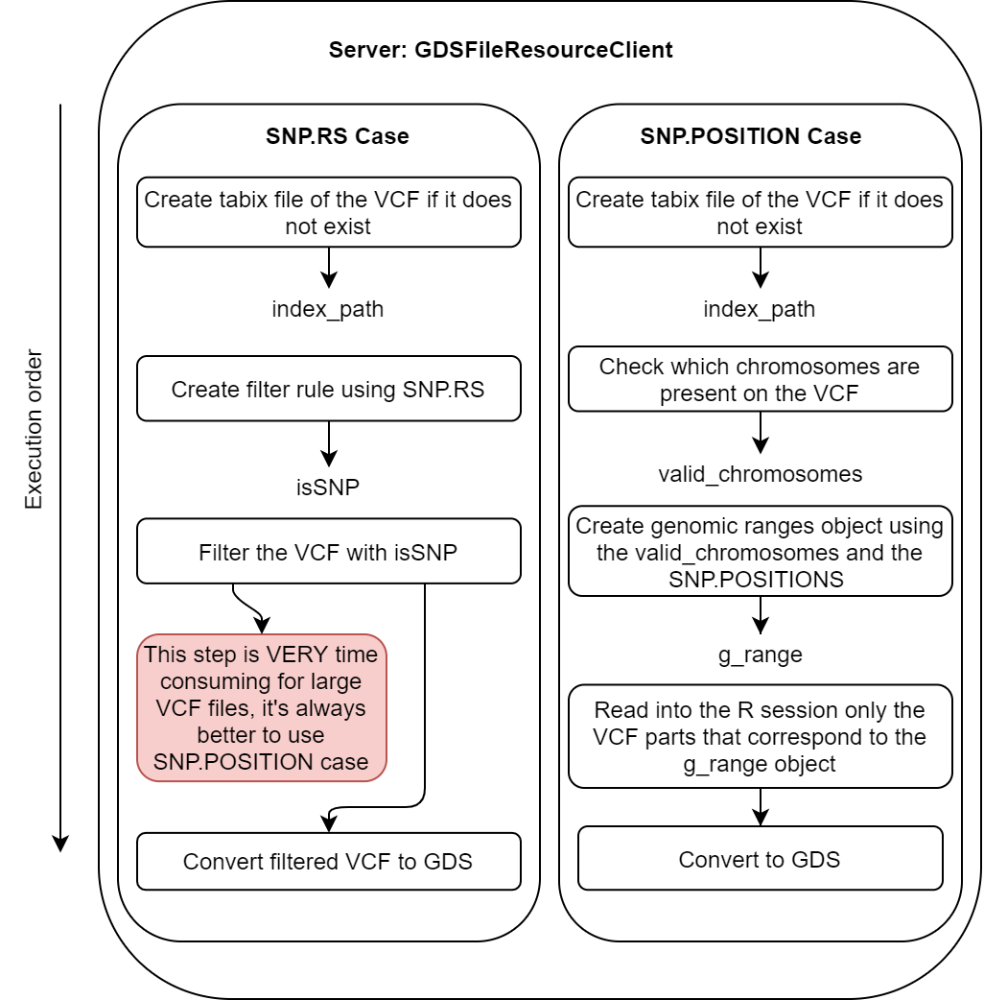
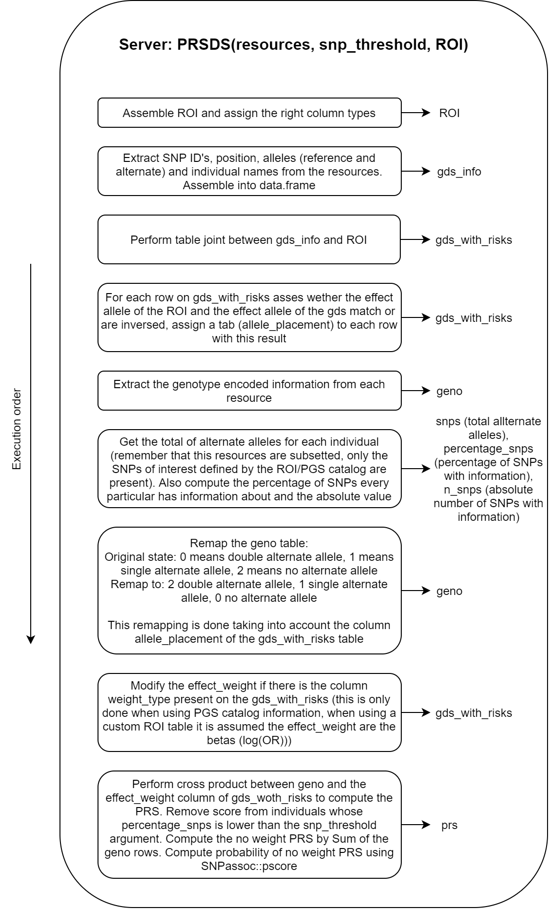

# (PART) Technical details {.unnumbered}

# GWAS

TODO

# Internal structure of the PRS functionality

The PRS function can be divided into three main blocks that perform the required tasks to come up with the results. The three functional blocks are the following:

-   Client: Assemble the `prs_table` table if PGS Catalog is used, perform calls to the server to subset the resources and calculate the PRS with the subsetted resources.
-   Server resolver: Resolve the selected resources (VCF files) and subset them using the prs_table.
-   Server analysis: Use the resolved resources (small VCF files with only the SNPs of interest according to the `prs_table` table) to calculate the PRS.

In order to introduce a little how those three blocks work internally, schematized flow charts have been designed. To understand the exact inner working of the functionality it is advised to follow the flowcharts alongside the actual source code. Find the links to the three blocks source code, [client](https://github.com/isglobal-brge/dsOmicsClient/blob/master/R/ds.PRS.R), [server resolver](https://github.com/isglobal-brge/dsOmics/blob/master/R/GDSFileResourceClient.R#L43) and [server analysis](https://github.com/isglobal-brge/dsOmics/blob/master/R/PRSDS.R).

## Client

The client performs two basic tasks. The first one is to select between a user introduced `prs_table` or to retrieve the `prs_table` from the PGS Catalog. Please note that `prs_table` stands for Region Of Interest, which may not be the common term for PGS analysis but it makes sense since it refers to a table that contain the SNP's of interest and their weight to the score. If the user introduces a custom `prs_table` and a PGS Catalog ID, only the introduced table will be used, discarding the PGS Catalog ID information. Once this table is assembled, the next step is to call the required functions on the study servers. First, the resource resolver is called, and after that, the function that calculates the PRS is called.

This is illustrated on the following figure.

```{r block1Image, echo=FALSE, fig.cap="Flow chart of the client block.", fig.align='center'}
knitr::include_graphics("fig/block1.png")
```

## Server resolver

The server resolver is in charge of resolving the resources. The interesting aspect is that only a region of interest is actually assigned to the R session, this is to avoid overloading the memory with unnecessary information. There are two different methodologies to perform this subsetting, one is using chromosome names and position and the other is using the SNP id's. Due to the technical specification of VCF files, is much easier to perform the subsetting using chromosome names and positions because there is an indexing file for the VCF files to perform fast queries of regions by position. On the other hand, to filter a VCF file using SNP id's, the whole file has to be scanned, yielding a much slower process.

This block is illustrated on the following figure.

```{r block2Image, echo=FALSE, fig.cap="Flow chart of the server resolver block.", fig.align='center'}

```

## Server analysis

Many processes are performed inside the analysis block. For that reason, more than a flow chart, a step by step guide has been illustrated with the objects that are created (or modified) on each step. The most important step on this block is making sure that the alternate (risk) alleles match between the VCF resources and the alternate alleles stated by the `prs_table` or PGS Catalog.

The block is illustrated on the following figure.

```{r block3Image, echo=FALSE, fig.cap="Flow chart of the server analysis block.", fig.align='center'}

```

# Compression of GDS files vs. performance

When working with genotype data, OmicSHIELD offers the possibility of using VCF and GDS formats. When a VCF is supplied, internally is converted to a GDS to work with it, for that reason it is always better to start with a GDS to improve the performance of the pipeline.

When converting to GDS using [gdsfmt](https://bioconductor.org/packages/release/bioc/html/gdsfmt.html), there are many compression options that will affect the final file size. This compression comes with an added cost, which is the read time. For very aggressive compression typically the reading time gets severely affected, so it is good to find a good balance. To help choosing the right compression we provide a comparison table between all the compression options, the table has been extracted from the [official documentation](https://bioconductor.org/packages/release/bioc/vignettes/gdsfmt/inst/doc/gdsfmt.html) of the `gdsgmt` package.

| Compression Method    | Raw  | ZIP    | ZIP_ra | LZ4   | LZ4_ra | LZMA  | LZMA_ra |
|:----------------------|:-----|:-------|:-------|:------|:-------|:------|:--------|
| Data Size (MB)        | 38.1 | 1.9    | 2.1    | 2.8   | 2.9    | 1.4   | 1.4     |
| Compression Percent   | 100% | 5.08%  | 5.42%  | 7.39% | 7.60%  | 3.65% | 3.78%   |
| Reading Time (second) | 0.21 | 202.64 | 2.97   | 84.43 | 0.84   | 462.1 | 29.7    |

At ISGlobal we are using the `LZ4_ra` compression method because it provides a very good compression level with the least effect to the reading time.