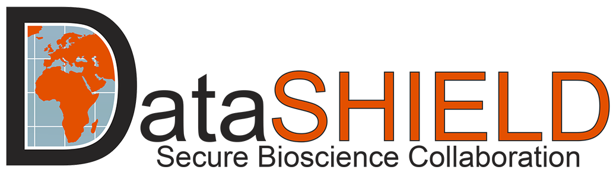

--- 
title: "Applications of OmicDataSHIELD in real data"
date: "`r Sys.Date()`"
output: bookdown::html_document2
site: bookdown::bookdown_site
documentclass: book
bibliography: [book.bib]
biblio-style: apalike
link-citations: yes
---

```{r, setup, include=FALSE}
knitr::opts_chunk$set(comment="", warning=FALSE, message=FALSE, cache=TRUE)
```

# Welcome {-}

{width=50%}

This is a website for a book that serves as official documentation for applications of OmicSHIELD. On it you will find: 


- GWAS of CINECA data split in 3 different cohorts stored in an Opal repository. Deliverable belonging to [VEIS project](https://veis.bsc.es/en/) that aims to value EGA for Industry and Society.


- Omic data analyses using HELIX project (6 cohorts). It includes:
 
     - Differential expression analysis 

     - Epigenome data analysis 

      - Exposome Data Analysis. Deliverable of [ATHLETE project](https://athleteproject.eu/).

All the applications described on this book have been developed at the Bioinformatic Research Group in Epidemiology ([BRGE](https://brge.isglobal.org/)) from ISGlobal with external collaborators and are part of OmicSHIELD.

{width=50%}

The aim of this book is to be a showcase of the capabilities of the software we developed in real problems where the main aim of describing how to perform omic data analyses in multi-cohort studies using a privacy-protected federated system.

This material also serves as an online companion for the manuscript "To be supplied".

This website is licensed under an [Attribution-NonCommercial-NoDerivatives 4.0 International (CC BY-NC-ND 4.0)](https://github.com/isglobal-brge/OmicSHIELDapps/blob/main/LICENSE).